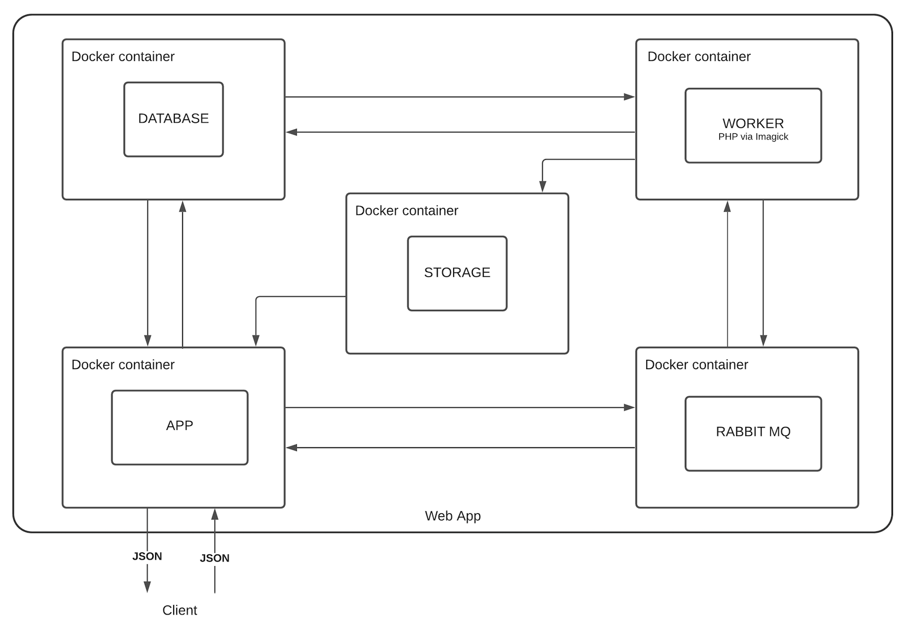
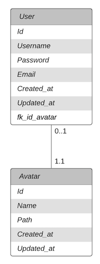

# HETIC - Image Resizer [WIP]

This school project aim to store user's profile and resize their avatar making use of a dedicated worker and a message broker.

## Summary 

- [The project](#MT4P2022_BACK-END_IMG-[WIP])
  - [Getting started](#Getting-started)
  - [Folder structure](#Folder-structure)
- [Stack](#Stack)
  - [Infrastructure](#Infrastructure)
  - [App container](#App-container)
  - [Worker container](#Worker-container)
  - [Storage container](#Storage-container)
  - [Database container](#Database-container)
    - [Entity relationship model](#Entity-relationship-model)
  

<!-- ## The (school) project -->

## Getting started 

1. Install and run the project via docker
```sh
$ docker-compose up
```
2. Run the worker 
```sh
$ docker exec img-resizer_worker php index.php
```
3. Acces the app at [`localhost`](http://localhost). At the moment, this url send a message to the message broker. If the worker catch the message, your installation works perfectly.

## Folder structure

- **./app :** contain application related files and the Dockerfile to build his Docker image
  - **index.php :** application root file
  - **MessageBroker.php :** a class to make easy the communication with the message broker
- **./documentation :** contain schema about the project
  - **Infrastructure.png :** schema of the infrastructure, showing relations between the docker containers
  - **MCD.png :** Entity relationship model
  - **MT4P2022 BACKEND - Schéma d'infrastructure & modèle de données.png :** All documentation schemas combined
- **./worker :** contain worker related files and the Dockerfile to build his Docker image
  - **Index.php :** code that runs the worker
  - **Worker.php :** the worker class that will resize avatars

# Stack
## Infrastructure



## App container

Client access the app at [`localhost`](http://localhost).

## Worker container

Starting the worker : 

```sh
$ docker exec img-resizer_worker php index.php
```

Worker will listen to the 'image-resizing' queue list and execute his 'action' function each time a message is received by the message broker.

## Storage container

Contains all the resized avatars in `./home/storage/avatar/`.  
To store them, use FTP :
-   address: storage
-   username: storage
-   password: storage

To check if FTP works from the Worker container, use the `checkFtp()` function from `worker/testFtpConnection.php`. 

## Database container

A MYSQL database that can be managed with PHPMyAdmin at [`localhost:8080`](http://localhost:8080) :
- username: root
- password: root

### Entity relationship model :


